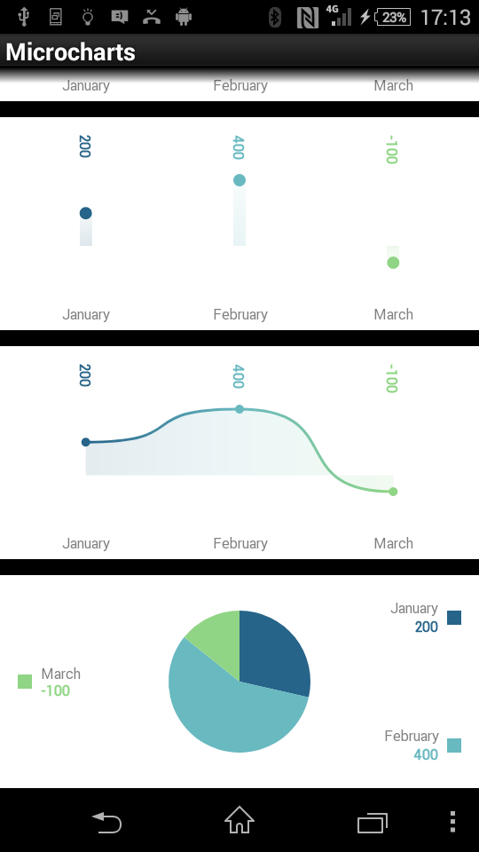

# Quickstart

## 1. Prepare the data

```csharp
var entries = new[]
{
    new Entry(200)
    {
		Label = "January",
		ValueLabel = "200",
		FillColor = SKColor.Parse("#266489")
    },
    new Entry(400)
    {
		Label = "February",
		ValueLabel = "400",
		FillColor = SKColor.Parse("#68B9C0")
    },
    new Entry(-100)
    {
		Label = "March",
		ValueLabel = "-100",
		FillColor = SKColor.Parse("#90D585")
    }
};
```

## 2. Choose a chart type

```csharp
var chart = new BarChart() { Entries = entries };
// or: var chart = new PointChart() { Entries = entries };
// or: var chart = new LineChart() { Entries = entries };
// or: var chart = new DonutChart() { Entries = entries };
// or: var chart = new RadialGaugeChart() { Entries = entries };
// or: var chart = new RadarChart() { Entries = entries };
```

## 3. Display the chart

```xml
<ContentPage 
    xmlns="http://xamarin.com/schemas/2014/forms" 
    xmlns:x="http://schemas.microsoft.com/winfx/2009/xaml" 
    xmlns:microcharts="clr-namespace:Microcharts.Forms;assembly=Microcharts.Forms" 
    xmlns:local="clr-namespace:Microcharts.Samples.Forms" 
    x:Class="Microcharts.Samples.Forms.MainPage">

    <microcharts:ChartView x:Name="chartView" />

</ContentPage>
```

```csharp
protected override void OnAppearing()
{
    base.OnAppearing();

    var entries = // ... see 1. above
    var chart = // ... see 2. above

    this.chartView.Chart = chart;
}
```

