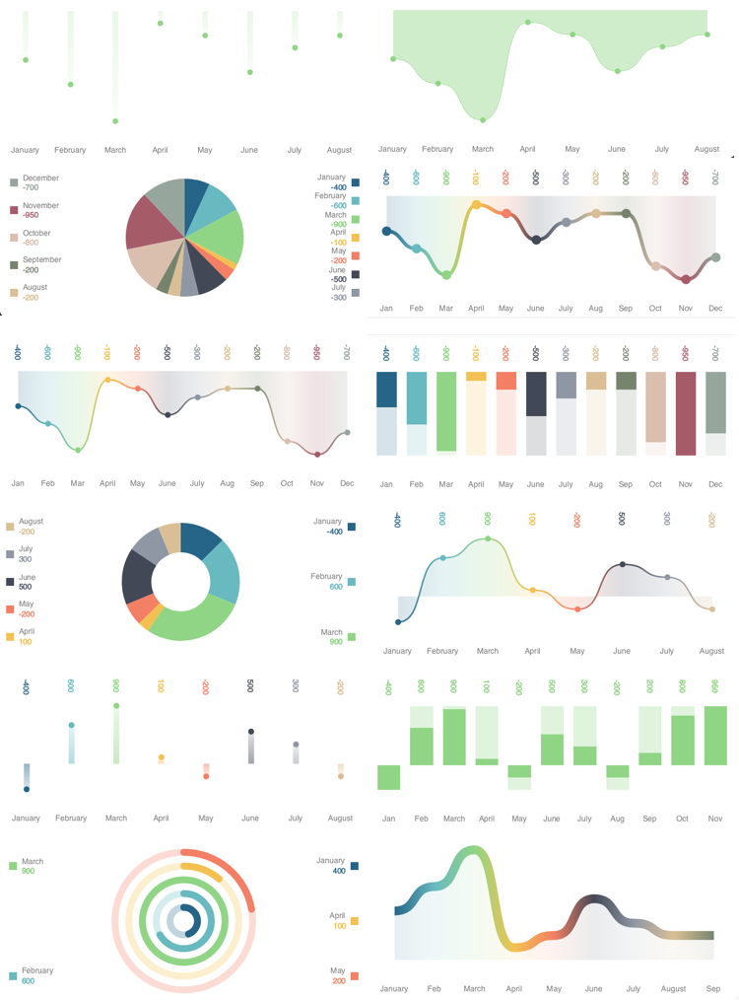
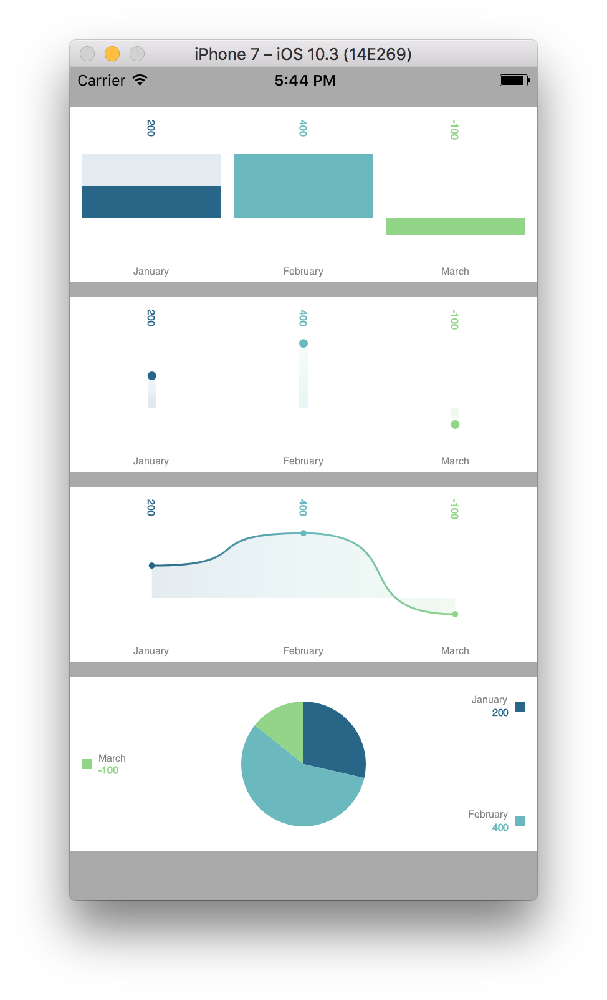
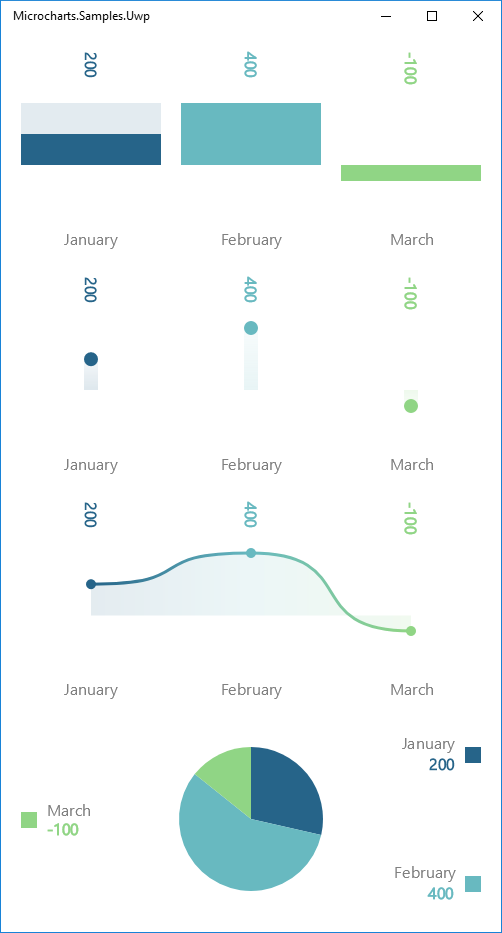

# Microcharts

**Microcharts** is an extremely simple charting library for a wide range of platforms (see *Compatibility* section below), with shared code and rendering for all of them!

## Gallery
 


## Install

Available on NuGet

[](https://www.nuget.org/packages/Microcharts/)

## Quickstart

### 1°) Your chart will need a set of data entries.

```csharp
var entries = new[]
{
	new Entry(200)
	{
		Label = "January",
		ValueLabel = "200",
		FillColor = SKColor.Parse("#266489"),
	},
	new Entry(400)
	{
		Label = "February",
		ValueLabel = "400",
		FillColor = SKColor.Parse("#68B9C0"),
	},
	new Entry(-100)
	{
		Label = "March",
		ValueLabel = "-100",
		FillColor = SKColor.Parse("#90D585"),
	},
};
```

### 2°) Instanciate a chart from those entries

```csharp
var chart = new BarChart() { Entries = entries };
// or: var chart = new PointChart() { Entries = entries };
// or: var chart = new LineChart() { Entries = entries };
// or: var chart = new DonutChart() { Entries = entries };
// or: var chart = new RadialGaugeChart() { Entries = entries };
```

### 2°) Add it to your UI!

**Xamarin.iOS**



```csharp
public override void ViewDidLoad()
{
	base.ViewDidLoad();

	var entries = // ... see 1°) above
	var chart = // ... see 2°) above

	var chartView = new ChartView
	{
		Frame = new CGRect(0, 32, this.View.Bounds.Width, 140),
		AutoresizingMask = UIViewAutoresizing.FlexibleWidth,
		Chart = chart,
	};

	this.View.Add(chartView);
}
```

**Xamarin.Android**


```xml
<?xml version="1.0" encoding="utf-8"?>
<ScrollView xmlns:android="http://schemas.android.com/apk/res/android"
    android:layout_width="match_parent"
    android:layout_height="match_parent">
    <LinearLayout 
        android:orientation="vertical"
        android:layout_width="match_parent"
        android:layout_height="wrap_content">
        <microcharts.droid.ChartView
            android:id="@+id/chartView"
            android:layout_width="match_parent"
            android:layout_height="160dp" />
    </LinearLayout>
</ScrollView>
```

```csharp
protected override void OnCreate(Bundle savedInstanceState)
{
	base.OnCreate(savedInstanceState);

	SetContentView(Resource.Layout.Main);

	var entries = // ... see 1°) above
	var chart = // ... see 2°) above

	var chartView = FindViewById<ChartView>(Resource.Id.chartView);
	chartView.Chart = chart;
}
```

**UWP (Windows 10)**



```xml
<Page
    x:Class="Microcharts.Samples.Uwp.MainPage"
    xmlns="http://schemas.microsoft.com/winfx/2006/xaml/presentation"
    xmlns:x="http://schemas.microsoft.com/winfx/2006/xaml"
    xmlns:local="using:Microcharts.Samples.Uwp"
    xmlns:microcharts="using:Microcharts.Uwp"
    xmlns:d="http://schemas.microsoft.com/expression/blend/2008"
    xmlns:mc="http://schemas.openxmlformats.org/markup-compatibility/2006"
    mc:Ignorable="d">

    <microcharts:ChartView x:Name="chartView" />

</Page>
```

```csharp
public MainPage()
{
    this.InitializeComponent();

	var entries = // ... see 1°) above
	var chart = // ... see 2°) above

	this.chartView.Chart = chart;
}
```

## Usage

Available charts are `BarChart`, `PointChart`, `LineChart`, `DonutChart`, `RadialGaugeChart`. They all have several properties to tweak their rendering.

Those charts have a `Draw` method for platforms that haven't built in views.

## Compatibility

Built in views are provided for **Xamarin.iOS** and **Xamarin.Android**, but any other [SkiaSharp](https://github.com/mono/SkiaSharp) supported platform is also compatible.

## About

This project is just simple drawing on top of the awesome [SkiaSharp](https://github.com/mono/SkiaSharp) library. The purpose is not to have an heavily customizable charting library. If you want so, simply fork the code, since all of this is fairly simple. Their is no interaction, nor animation at the moment.

## Contributions

Contributions are welcome! If you find a bug please report it and if you want a feature please report it.

If you want to contribute code please file an issue and create a branch off of the current dev branch and file a pull request.

## License

MIT © [Aloïs Deniel](http://aloisdeniel.github.io)