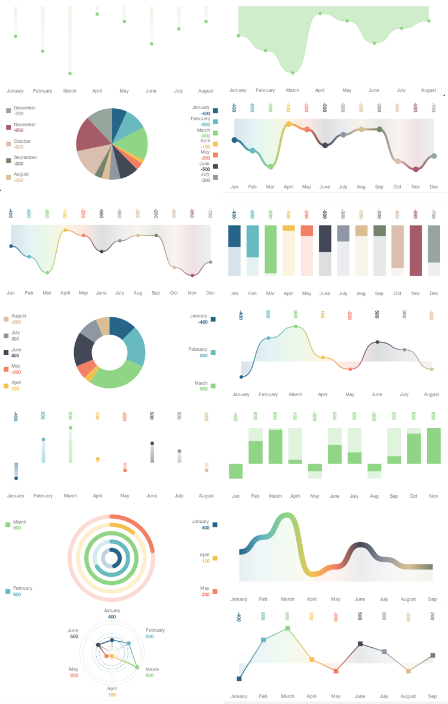

# Microcharts

**Microcharts** is an extremely simple charting library for a wide range of platforms (see *Compatibility* section below), with shared code and rendering for all of them!

Read our [wiki](https://github.com/microcharts-dotnet/Microcharts/wiki) to learn more about how to use this library.

## About

This project is just simple drawing on top of the awesome [SkiaSharp](https://github.com/mono/SkiaSharp) library. The purpose is not to have an heavily customizable charting library. If you want so, simply fork the code, since all of this is fairly simple.

## Contributions

Contributions are welcome! If you find a bug please report it and if you want a feature please report it.

If you want to contribute code please file an issue and create a branch off of the current dev branch and file a pull request.

More info on how you can help can be found [here](https://github.com/microcharts-dotnet/Microcharts/wiki/Contributing).

## Gallery

## Install

Available on NuGet

* [Microcharts](https://www.nuget.org/packages/Microcharts/)
* [Microcharts.Core](https://www.nuget.org/packages/Microcharts.Core/)
* [Microcharts.Maui](https://www.nuget.org/packages/Microcharts.Maui/)
* [Microcharts.iOS](https://www.nuget.org/packages/Microcharts.iOS/)
* [Microcharts.Android](https://www.nuget.org/packages/Microcharts.Droid/)

**.NET MAUI**

Don't forget to call `UseMicrocharts()` on `MauiAppBuilder` in the `MauiProgram` class.

## Tutorials

* [Video: Charts for Xamarin Forms](https://www.youtube.com/watch?v=tmymWdmf1y4) by [@HoussemDellai](https://github.com/HoussemDellai)

## Compatibility

Built in views are provided for:

* .NET 10 (on all platforms)
* MAUI (Windows, Android, iOS, and macOS Catalyst)

## License

MIT © [Aloïs Deniel](https://aloisdeniel.com), [Ed Lomonaco](https://edlomonaco.dev) & [Jonas Follesø](https://github.com/follesoe)
